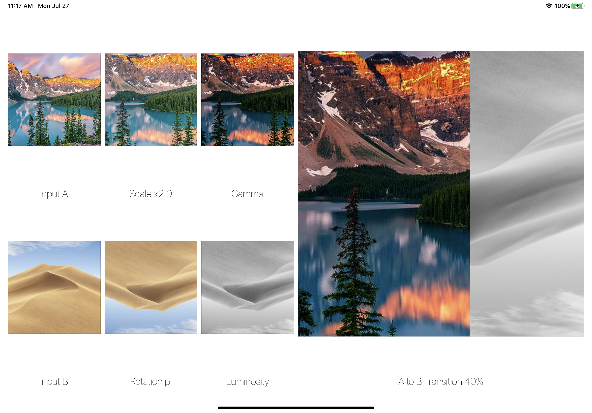

# LvJing

[](https://travis-ci.org/Ke Yang/LvJing)
[](https://cocoapods.org/pods/LvJing)
[](https://cocoapods.org/pods/LvJing)
[](https://cocoapods.org/pods/LvJing)

LvJing is a minimum graphic filter kernel based on Metal, it offers extensible interface and protocol for inheritance and assembling. The architecture is inspired by [Metal by Tutorials (Caroline Begbie & Marius Horga, raywenderlich.com)](https://store.raywenderlich.com/products/metal-by-tutorials) and famous-big-brother [GPUImage](https://github.com/BradLarson/GPUImage). LvJing merely acts as a carriage of Metal shading codes, it's mathematics and, behind all, your creativity  that really shines.
Have fun.

## Example

Example contains a single view demonstrating a binary filter tree consists of several basic filters inherit from LvJing filter. To run the example project, clone the repo, and run `pod install` from the Example directory first.



### Write your own filter?

Let's build a gamma filer with its own MSL:

```C++
// Gamma.metal

#include <metal_stdlib>
using namespace metal;

struct VertexOut {
   float4 position [[position]];
   float2 uv;
};

float4 adjustGamma(float4 in, float power) {
   return float4(pow(in.rgb, power), in.a);
}

vertex VertexOut vertex_main(const constant float4 *vertexArray [[buffer(0)]],
                             unsigned int vid [[vertex_id]])
{
   float4 currentVertex = vertexArray[vid];
   VertexOut out {
      .position = float4(currentVertex.x, currentVertex.y, 0, 1),
      .uv = float2(currentVertex.z, currentVertex.w)
   };
   return out;
}

fragment float4 fragment_gamma(VertexOut in [[stage_in]],
                               constant float &gamma [[buffer(0)]],
                               texture2d<float> colorTexture [[texture(0)]],
                               sampler textureSampler)
{
   float4 originColor = colorTexture.sample(textureSampler, in.uv);
   if (gamma == 1.0) {
      return originColor;
   }
   return adjustGamma(originColor, gamma);
}
```

```Swift
// GammaFilter.swift

import MetalKit
import LvJing

public final class GammaFilter: LvJing {
   
   public var gamma: Float = 1.0
   
   public init(resolution: CGSize) {
      super.init(
         resolution: resolution,
         libraryURL: nil,
         vertexFunctionName: "vertex_main",
         fragmentFunctionName: "fragment_gamma")
   }
   
   public override func setFragmentBytesFor(encoder: MTLRenderCommandEncoder) {
      encoder.setFragmentBytes(
         &gamma,
         length: MemoryLayout<Float>.stride,
         index: 0)
   }
}
```

### Chain them together?

```Swift
struct BinaryTreePreview: View {
   
   @State private var originImageA: CGImage!
   
   @State private var originImageB: CGImage!
   
   @State private var inputA: InputPlaceholder!
   
   @State private var inputB: InputPlaceholder!
   
   @State private var alphaFilterA: AffineTransformFilter!
   
   @State private var alphaFilterB: GammaFilter!
   
   @State private var betaFilterA: AffineTransformFilter!
   
   @State private var betaFilterB: LuminosityFilter!
   
   @State private var terminal: SwipeTransitionFilter!

   @State private var bufferPool: CVPixelBufferPool!
   
   @State private var finalOuput: CGImage!

   func buildUp() {
      self.inputA = InputPlaceholder(cgImage: self.originImageA!)
      self.inputB = InputPlaceholder(cgImage: self.originImageB!)
      // alpha branch
      self.inputA +> self.alphaFilterA +> self.alphaFilterB +> self.terminal
      // beta branch
      self.inputB +> self.betaFilterA +> self.betaFilterB +> self.terminal
   }

   func process() {
      var buffer: CVPixelBuffer?
      let success = CVPixelBufferPoolCreatePixelBuffer(
         nil,
         self.bufferPool!,
         &buffer)
      guard success == kCVReturnSuccess else { return }

      // make filter tree propagates from its entrances;
      self.terminal.propagate()
      // draw final image into buffer;
      self.terminal => buffer!
      // get output;
      self.finalOuput = CGImage.make(pixelBuffer: buffer!)
      // do what you want with it...
   }

   func breakDown() {
      self.terminal.disconnect()
   }
}
```

## Requirements

* Swift ONLY
* iOS 9.0+
* macOS 10.15.5 (at least)
* Catalyst compatible

## Installation

LvJing is available through [CocoaPods](https://cocoapods.org). To install
it, simply add the following line to your Podfile:

```ruby
pod 'LvJing'
```

## Author

Ke Yang, ofveravi@gmail.com

## License

LvJing is available under the MIT license. See the LICENSE file for more info.
